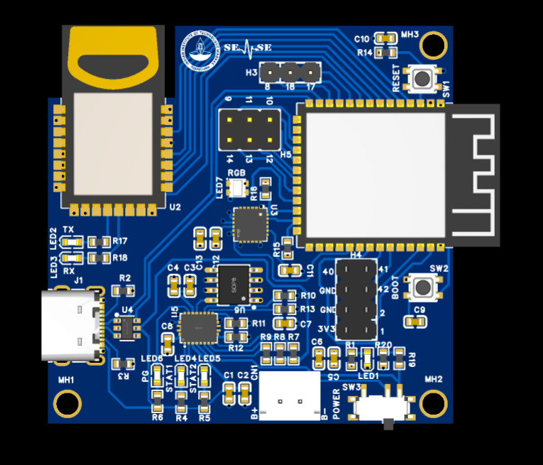
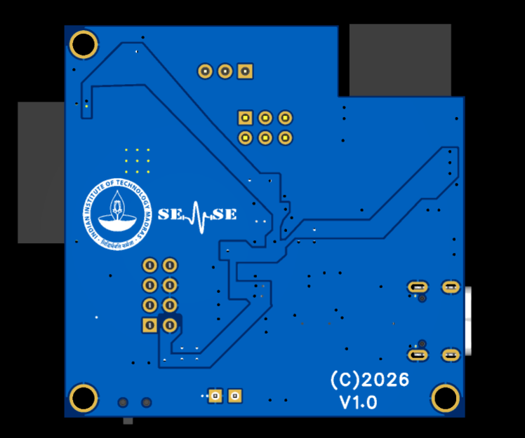

# UWB-Based Positioning and Motion Tracking PCB

<p align="center">
  
</p>

<p align="center">


</p>

---

## 📌 Overview

This project presents the design, development, and manufacturing of a **portable, battery-powered Ultra-Wideband (UWB) positioning and motion tracking PCB** capable of **centimeter-level indoor localization** and **real-time motion sensing**.

The board is built around the **ESP32-S3-WROOM-1-N16R8** microcontroller and integrates a **BU-01 UWB module** for high-accuracy ranging together with an **MPU6050 Inertial Measurement Unit (IMU)** for orientation and motion tracking.

Unlike conventional GPS-based positioning systems, this PCB is designed specifically for **indoor environments**, where satellite signals are unreliable or unavailable.

The board includes a complete power management subsystem consisting of battery charging, dynamic power-path management, voltage regulation, battery monitoring, and USB Type-C connectivity, making it suitable for both research and portable embedded applications.

---

## 📸 PCB Images

| Top View | Bottom View |
|----------|-------------|
|  |  |

---

# ✨ Features

- 📡 High-Accuracy Ultra-Wideband Positioning
- 🎯 Centimeter-Level Indoor Localization
- 🛰 ESP32-S3 Dual-Core Processor
- 📶 Wi-Fi + Bluetooth 5 LE
- 🧭 6-Axis Motion Tracking
- 🔋 Battery Powered
- 🔌 USB Type-C Programming
- ⚡ Dynamic Power Path Management
- 🌈 WS2812B RGB Status LED
- 📈 Battery Voltage Monitoring
- 🔄 Expansion GPIO Headers
- 📊 Low Power Consumption

---

# 📅 Timeline

| Event | Date |
|-------|------|
| Project Started | June 2026 |
| PCB Design Completed | June 2026 |
| PCB Manufactured | July 2026 |
| Hardware Testing | July 2026 |
| Current Version | **V1.0** |

---

# 🚩 Problem Statement

Indoor positioning remains a significant challenge because conventional GPS systems suffer from:

- Weak or unavailable satellite signals indoors
- Multipath interference
- Poor localization accuracy
- High positioning errors

Many robotics, automation, industrial, and wearable applications require **high-accuracy indoor positioning** while maintaining **low power consumption** and **portable operation**.

---

# 💡 Proposed Solution

This project addresses these challenges by integrating:

- **ESP32-S3-WROOM-1-N16R8**
  - Dual-Core Xtensa LX7
  - 240 MHz
  - 16 MB Flash
  - 8 MB PSRAM
  - Wi-Fi
  - Bluetooth 5 LE

- **BU-01 Ultra-Wideband Module**
  - IEEE 802.15.4-2011 compliant
  - 3.5–6.5 GHz operation
  - SPI communication
  - Supports TWR and TDoA localization

- **MPU6050 IMU**
  - 3-axis Accelerometer
  - 3-axis Gyroscope
  - Digital Motion Processor (DMP)

- **Power Management**
  - BQ24070 Battery Charger
  - Dynamic Power Path Management (DPPM)
  - LT1963A Low Noise LDO
  - Battery Voltage Monitoring

- **User Interface**
  - WS2812B RGB LED
  - TX LED
  - RX LED
  - Power LED
  - Charging LEDs
  - Boot Button
  - Reset Button

---

# 🏗 System Architecture

```text
                   USB Type-C
                        │
                        ▼
          ┌──────────────────────────┐
          │    BQ24070 Charger IC    │
          └────────────┬─────────────┘
                       │
          Dynamic Power Path Management
                       │
                       ▼
             LT1963A 3.3V LDO Regulator
                       │
          ┌────────────┴────────────┐
          │                         │
          ▼                         ▼
     ESP32-S3 MCU              MPU6050 IMU
          │
          │ SPI
          ▼
      BU-01 UWB Module
          │
          ▼
 Indoor Positioning & Ranging
```

---

# ⚙️ System Workflow

```text
          UWB Ranging
               │
               ▼
      Distance Measurement
               │
               ▼
      IMU Motion Detection
               │
               ▼
       ESP32 Sensor Fusion
               │
               ▼
    Position & Motion Estimation
               │
               ▼
 Wi-Fi / Bluetooth / UWB Output
```

---

# 🔧 Hardware Specifications

## Microcontroller

| Parameter | Value |
|-----------|-------|
| MCU | ESP32-S3-WROOM-1-N16R8 |
| CPU | Dual-Core Xtensa LX7 |
| Clock | 240 MHz |
| Flash | 16 MB |
| PSRAM | 8 MB |

---

## UWB Module

| Parameter | Value |
|-----------|-------|
| Module | BU-01 |
| Frequency | 3.5–6.5 GHz |
| Interface | SPI |
| Data Rates | 110 kbps, 850 kbps, 6.8 Mbps |
| Positioning | TWR, TDoA |

---

## Motion Sensor

| Parameter | Value |
|-----------|-------|
| Sensor | MPU6050 |
| Accelerometer | ±2g / ±4g / ±8g / ±16g |
| Gyroscope | ±250 / ±500 / ±1000 / ±2000 °/s |
| Interface | I²C |

---

# 🔋 Power Management

The PCB integrates a complete battery management subsystem.

### Battery Charger

- Texas Instruments **BQ24070**
- Dynamic Power Path Management
- Simultaneous charging and operation
- Over-current protection
- Reverse current protection
- Short circuit protection

### Voltage Regulation

- LT1963A 3.3V LDO
- 1.5A Output Current
- Low Noise
- High Stability

### Battery Monitoring

Battery voltage is continuously monitored using the ESP32 ADC through a resistor divider.

---

# 🔌 Communication Interfaces

## SPI

Used for communication with the UWB Module.

| ESP32 Pin | BU-01 Pin |
|------------|------------|
| GPIO10 | CS |
| GPIO11 | MOSI |
| GPIO12 | CLK |
| GPIO13 | MISO |
| GPIO14 | RESET |
| GPIO15 | WAKEUP |
| GPIO4 | IRQ |

---

## I²C

Used for communication with MPU6050.

| ESP32 Pin | MPU6050 |
|------------|------------|
| GPIO8 | SDA |
| GPIO9 | SCL |
| GPIO18 | INT |

---

# 💻 Software

Compatible with

- Arduino IDE
- ESP-IDF
- PlatformIO
- Thonny IDE

Programming Languages

- C
- C++
- Arduino
- ESP-IDF

---

# 📐 PCB Specifications

| Parameter | Value |
|-----------|-------|
| Dimensions | **51 mm × 50.1 mm** |
| PCB Layers | 2 |
| Mounting Holes | 3 × M2 |
| Hole Diameter | 2.7 mm |
| Power Input | USB Type-C / 1S Li-Ion |
| Supply Voltage | 3.3 V |

---

# ⚡ Power Consumption

| Mode | Current | Power |
|------|---------|-------|
| Typical | 217 mA | 0.72 W |
| Worst Case | 500 mA | 1.65 W |

LDO Capability

- **3.3V @ 1.5A**
- Maximum Available Power ≈ **5 W**
- Design Headroom ≈ **67%**

---

# 🌍 Applications

- Indoor Positioning Systems
- Drone Navigation
- Autonomous Robots
- Warehouse Automation
- Motion Capture
- Wearable Devices
- Asset Tracking
- Industrial RTLS
- Smart Factories
- IoT Systems
- Research & Development

---

# 📂 Repository Structure

```text
UWB-Based-Positioning-and-Motion-Tracking-PCB
│
├── Hardware
│   ├── Schematic
│   ├── PCB
│   ├── Gerbers
│   ├── BOM
│   └── Pick_and_Place
│
├── Firmware
│   ├── Examples
│   ├── Drivers
│   └── Source
│
├── Images
│
├── Docs
│   └── UWB-Based-Positioning-and-Motion-Tracking-PCB.pdf
│
└── README.md
```

---

# 🚀 Future Improvements

- Extended Kalman Filter (EKF)
- UWB + IMU Sensor Fusion
- SLAM Support
- BLE Beacon Positioning
- OTA Firmware Updates
- Mobile Monitoring Application
- Cloud Connectivity
- AI-based Motion Analysis

---

# 👨‍💻 Author

**Arpan Dutta**

**B.Tech Undergraduate**  
Department of Electronics and Communication Engineering

**National Institute of Technology Durgapur**

📅 **July 2026**

### Summer Internship

Designed and manufactured during the **Summer Research Internship** under

**Professor Ayon Chakraborty**

Department of Engineering Design

**Indian Institute of Technology Madras (IIT Madras)**

### Responsibilities

- PCB Design
- Circuit Design
- Component Selection
- Power Management Design
- ESP32 Integration
- UWB Integration
- IMU Integration
- Hardware Bring-up
- Prototype Testing
- Documentation

---

# 📄 Documentation

Complete technical documentation is available.

The documentation includes:

- Complete circuit description
- Power calculations
- Communication protocols
- PCB specifications
- Pin mapping
- Design calculations
- Component selection
- Mechanical dimensions

---

# 🙏 Acknowledgements

Special thanks to:

- Espressif Systems
- Ai-Thinker
- Texas Instruments
- Analog Devices
- TDK InvenSense
- STMicroelectronics
- **Professor Ayon Chakraborty**
- **Indian Institute of Technology Madras**

for providing technical references and guidance that made this project possible.

---

# 📜 License

This project is released under the **MIT License**.

You are free to:

- ✅ Use
- ✅ Modify
- ✅ Distribute
- ✅ Commercialize

provided appropriate attribution is given.

---

<p align="center">

⭐ If you found this project interesting, consider giving it a star!

</p>
